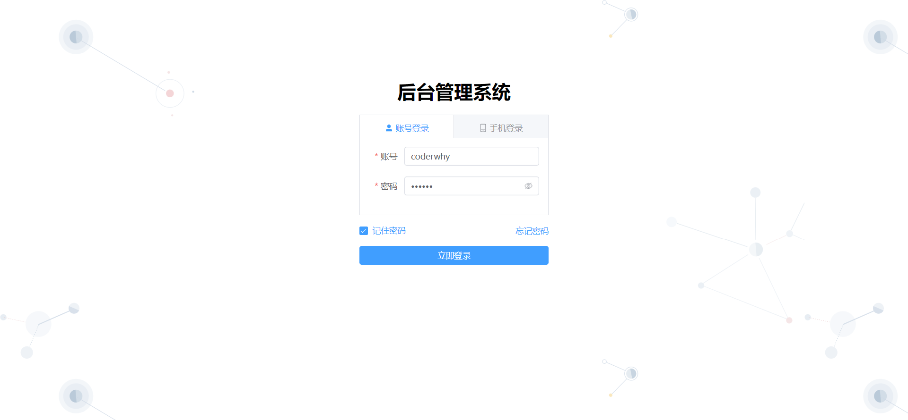
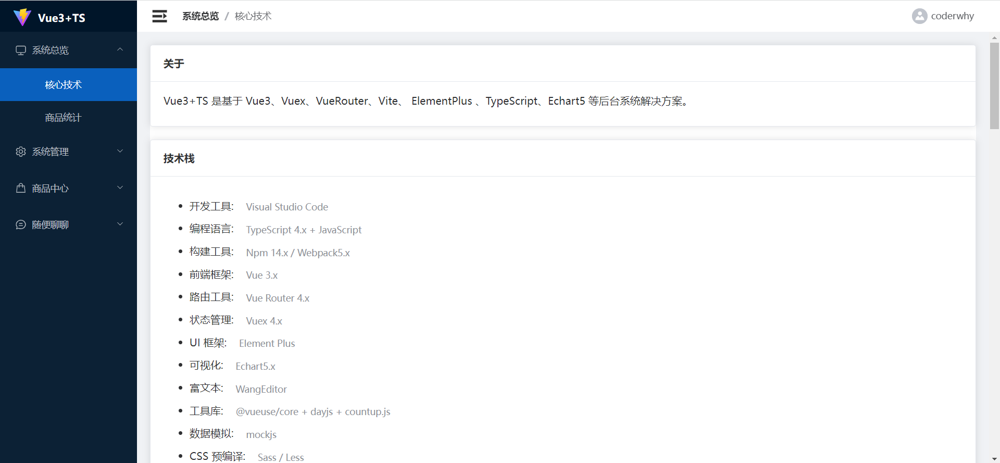
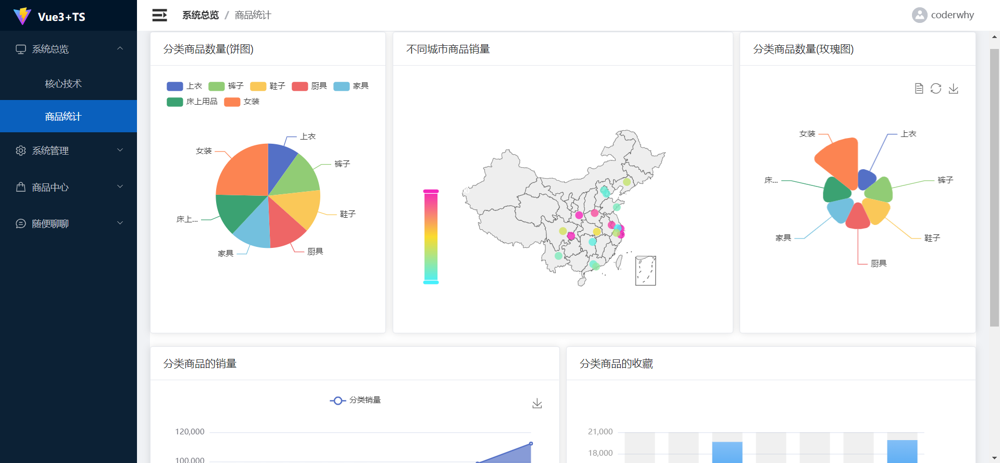
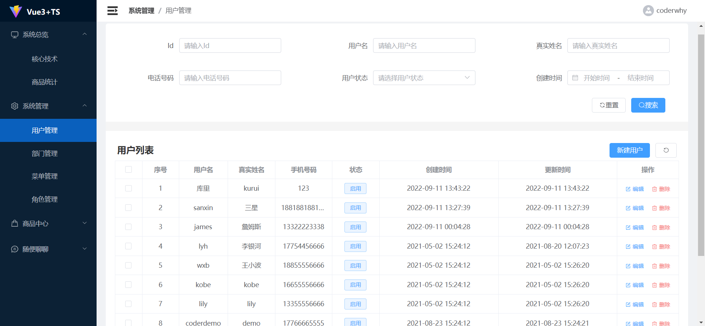
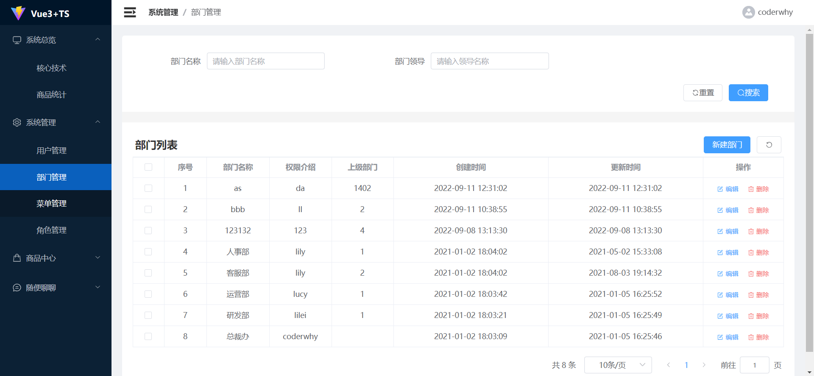
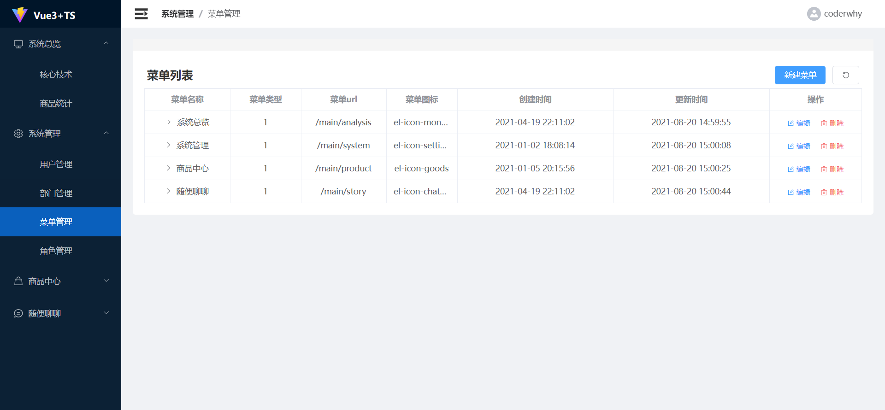
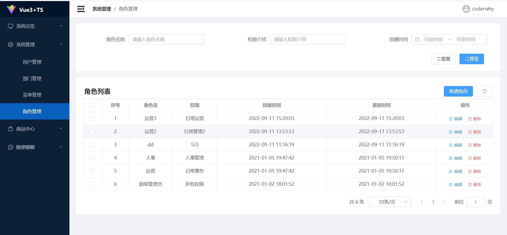
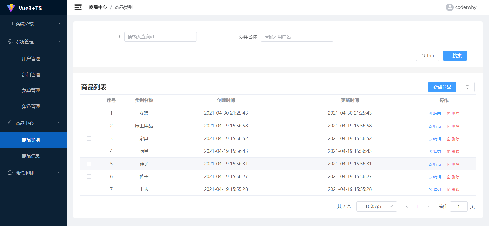
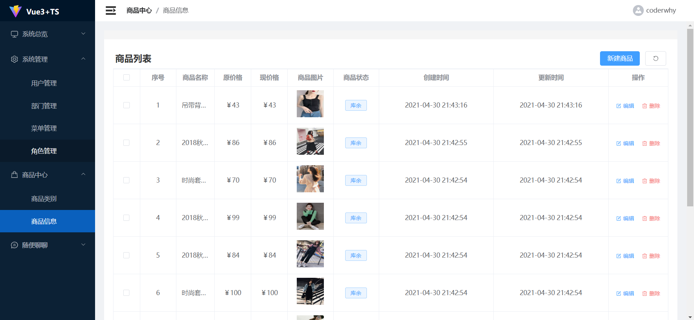
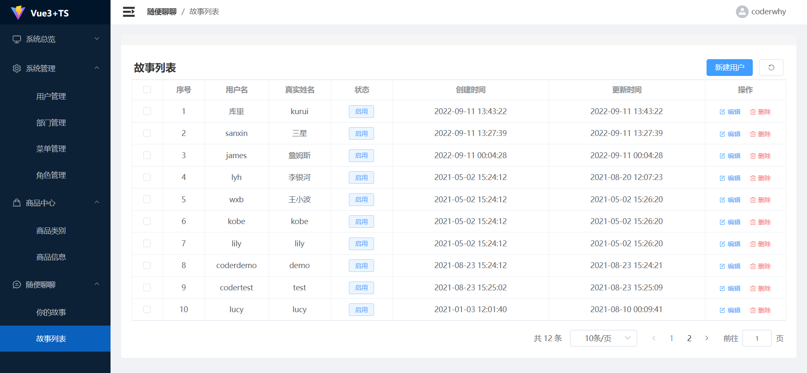

<h2 align="center">后台管理系统</h2>

Content manage System 是一个基于vue3 + Typescript + Element-plus + Echarts 开发的后台管理系统，具有登录验证、动态路由、系统管理、用户管理、角色管理、内容管理、菜单管理等多功能系统。内含多组件封装、网络请求封装等知识运行，是一个通用的后台管理系统。

### 功能简介

------

- 登录 / 注销

- 动态路由

  - 登录验证
  - 权限控制（开发中）

- 全局功能

  (1)	登录验证

  通过发送网络请求对登录的用户进行登录权限验证。

  (2)	用户权限

  使用本系统，可以建立不同的角色人员，每个角色的权限不同，获取展示的动态菜单不同，对系统的操作权限不同，初始登录默认使用管理员。

  (3)	系统总览

  展示本系统所使用的核心技术栈，以及对内容的数据统计，通过Echarts技术进行图形可视化展示。

  (4)	系统管理

  对用户、部门、菜单、角色的增删改查，实现不同用户通过不同的权限对系统的操作处理。

  (5)	商品内容中心

  展示商品	的内容和类别，展示各类商品的详细信息，以及对商品内容的操作管理。

### 演示地址

------

演示地址 

localhost:8080

### 系统截图





















------

### 安装步骤

------

```bash
# 安装依赖
npm install

# 访问地址 localhost:8088
npm run serve

# 编译打包
npm run build
```

### 目录结构

------


### 浏览器兼容

------

| [](http://godban.github.io/browsers-support-badges/)<br>IE / Edge | [](http://godban.github.io/browsers-support-badges/)<br>Firefox | [](http://godban.github.io/browsers-support-badges/)<br>Chrome | [](http://godban.github.io/browsers-support-badges/)<br>Safari | [](http://godban.github.io/browsers-support-badges/)<br>Opera |
| --------- | --------- | --------- | --------- | --------- |
| IE11, Edge| last 2 versions| last 2 versions| last 2 versions| last 2 versions

### 捐赠

------

项目的创作离不开您的支持，如果你觉得此项目能够帮助到您，不如点个star支持作者吧， 谢谢！